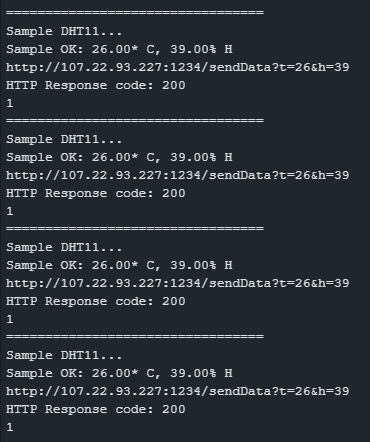
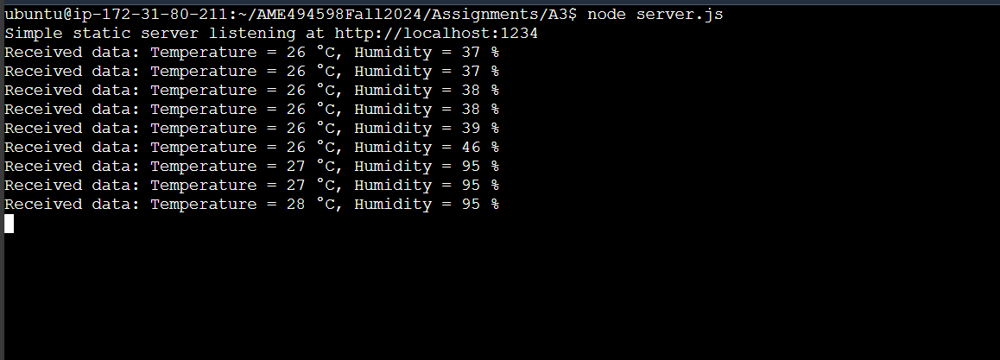

# Assignment 3: DHT11 Sensor with ESP32 and AWS EC2

## Overview
This assignment covers the following tasks:
1. Connecting a DHT11 sensor to the ESP32 and reading temperature and humidity values.
2. Sending the sensor data over HTTP to a server running on an AWS EC2 instance.
3. Configuring the EC2 server to receive test data using an HTTP server.

## Tasks Breakdown
### Connecting the DHT11 Sensor to the ESP32 and sending data over HTTP
- **Hardware Setup:** 
  - Connect the DHT11 sensor to the ESP32 as follows:
    - VCC (3.3V) on DHT11 to 3V3 on ESP32.
    - GND on DHT11 to GND on ESP32.
    - DATA on DHT11 to pin 25 on ESP32.
- **Code:**
  - The provided code for the TTGO watch reads temperature and humidity values from the DHT11 sensor using the SimpleDHT11 library 
  - The Arduino code is available in the repository: [sendData_TempHum.ino](https://github.com/VedantC2307/AME494598Fall2024/tree/main/Assignments/A3/sendData_TempHum/sendData_TempHum.ino).
  - Upload and run the ESP32 code.
  - The ESP32 code sends the sensor data over HTTP to the server hosted on the EC2 instance
  
### 2. Configuring the EC2 Server to Receive Data
- The AWS EC2 instance is set up to receive HTTP requests.
- **Steps:**
  1. Open the Sandbox Environment on Canvas.
  2. Start Lab and then click on the AWS button when it turns green.
  
  3. Create a new EC2 instace.
  
  4. Configure the EC2 security group to allow incoming HTTP traffic on the required port.
  5. Install nodejs and other neccessary libraries
  6. Run the HTTP server code to receive data from the ESP32

## How to Run the Project
1. Connect the DHT11 sensor to the ESP32 as per the wiring instructions.
2. Flash the `sendData_TempHum.ino` code to the ESP32.
3. On the EC2 instance, clone the github repo.
   ```bash
   git clone https://github.com/VedantC2307/AME494598Fall2024.git
   ```
5. Run the HTTP server to listen for incoming data.
   ```bash
   cd AME494598Fall2024/Assignments/A3
   node server.js
   ```
6. The ESP32 will automatically send temperature and humidity data to the EC2 server at regular intervals.
    
   This is teh putput in the serial monitor showing successfull reading and sending of Temperature and Humidity data.
8. Below is the screenshot of the output from the EC2 instance.
    

